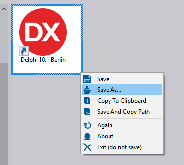
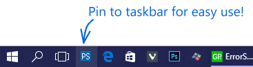
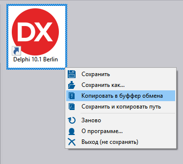
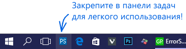

# ProjectScreen
## **[ENG]**  

### [Download](https://raw.githubusercontent.com/errorcalc/ProjectScreen/master/Release/ProjectScreen.zip) 

This program built in **Delphi 10**

This is a free program for easy make screenshots in **one click**.

**Try it program and you will use it constantly!**

Select using **Right** mouse button to popup the additional menu!(on screenshot)  
Use cursor keys to change the start position.  
In **Config.ini** (in the directory with the program), you can change the settings.  

**Fetaures:**  
* **Super fast startup**, unlike the built-in Windows tools "Cut" written on .net
* Make screenshot in **one click**
* Save as PNG, JPEG, BMP
* Custom path to save
* More options in **Config.ini**

You can find other programs on the website:  
http://errorsoft.org

Comments and bug reports write here:  
errorsoft@mail.ru

# ProjectScreen
## **[RUS]**  

### [Скачать](https://raw.githubusercontent.com/errorcalc/ProjectScreen/master/Release/ProjectScreen.zip)

Данная программа написана в **Delphi 10**

Бесплатная программа для снятия скриншотов в **один клик**.

**Попробуйте данную программу, и вы станите использовать ее постоянно!**

Выделяйте **правой** кнопокой, для вызова меню дополнительных вохможностей!(на скриншоте)  
Используйте курсорные клавиши, для изменения начальной позиции.  
В **Config.ini** (в директории с программой), вы можете изменить настройки.  

**Возможности:**  
* Моментальный запуск, в отличие от встроенной в Windows утилиты "Ножницы", написанной на .net
* Создание скриншотов **в один клик**
* Сохранение в форматах PNG, JPEG, BMP
* Возможность задать кастомный путь для сохранения
* Больше параметров в **Config.ini**

Другие программы:
http://errorsoft.org и  
http://vk.com/errorsoft

Пишите отзывы и баг репорты сюда:
errorsoft@mail.ru

